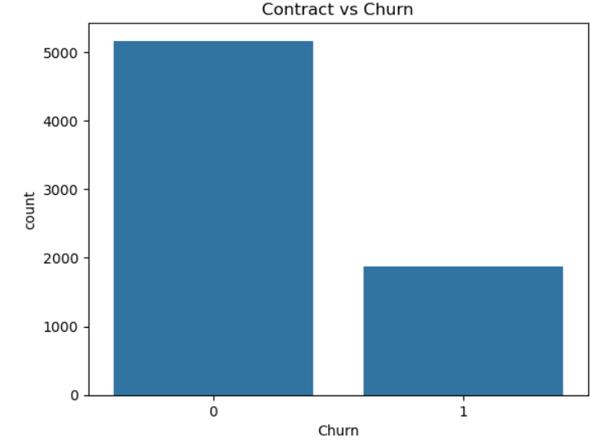
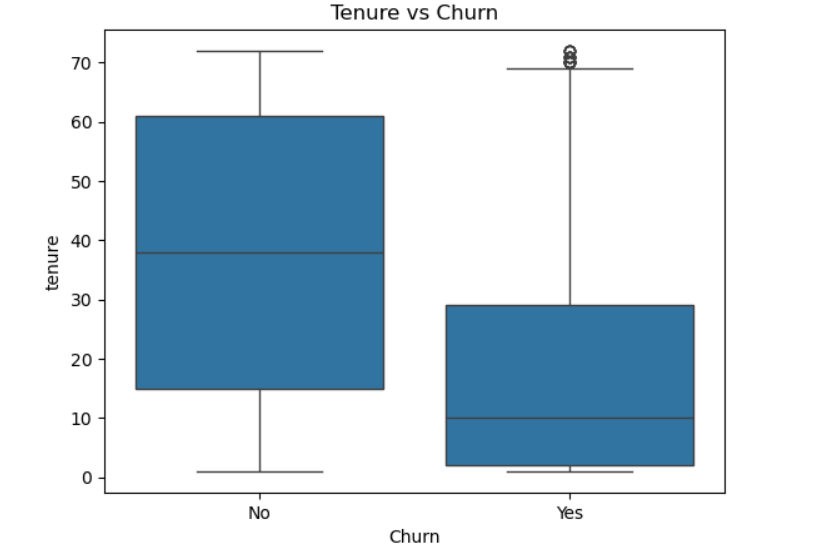
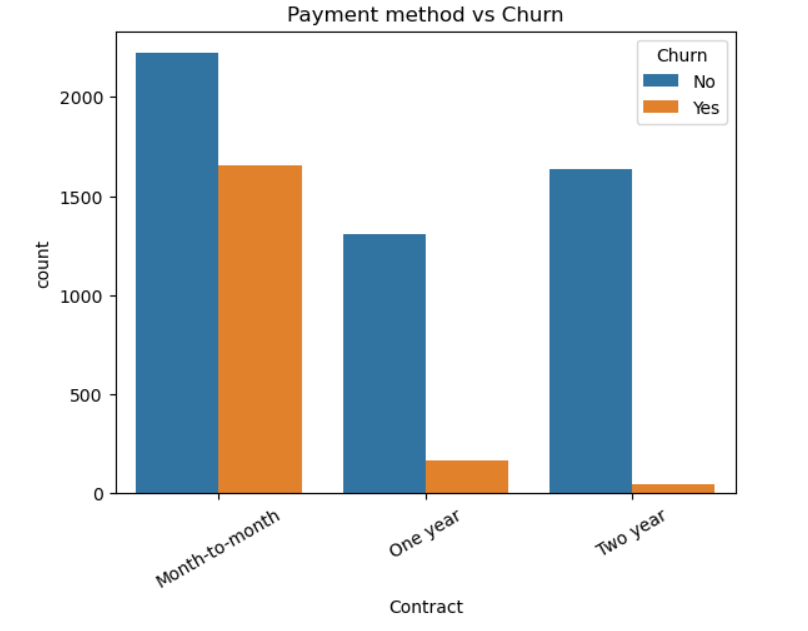
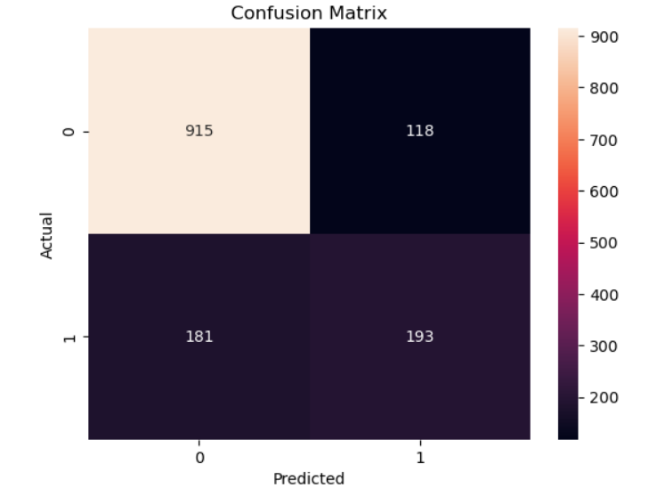

# 🚀 Customer Churn Prediction & Analysis (ML + Power BI)

## 📌 Project Overview

This project focuses on predicting customer churn using Machine Learning and delivering business insights through an interactive Power BI dashboard.

The solution identifies high-risk customers and helps businesses take proactive actions to improve customer retention.

---

## 🎯 Objectives

* Analyze customer behavior and churn patterns
* Build a predictive model for churn probability
* Segment customers into Low, Medium, and High Risk
* Create an interactive dashboard for decision-making

---

## 🛠 Tech Stack

* **Python**: Pandas, NumPy, Matplotlib
* **Machine Learning**: Scikit-learn, XGBoost
* **Visualization**: Power BI

---

## 📊 Key Results

* Total Customers: **7032**
* Churned Customers: **1869**
* Churn Rate: **27%**
* High Risk Customers: **243**

---

## 📈 Model Performance

* Model Used: **XGBoost Classifier**
* Accuracy: ~**80–85%**
* Output: Churn Probability (0–1)

---

## 🧠 Risk Segmentation

Customers are classified into risk categories using percentile-based segmentation on predicted churn probability:

* 🟢 Low Risk
* 🟠 Medium Risk
* 🔴 High Risk

This approach ensures balanced and meaningful classification of customers.

---

## 📊 Dashboard Preview

### 🔹 Main Dashboard


---

### 🔹 Customer Risk Distribution


---

### 🔹 Churn Rate by Risk Level


---

### 🔹 Contract vs Churn



---

### 🔹 Monthly Charges vs Churn


---

### 🔹 Tenure vs Churn



---

### 🔹 Payment Method vs Churn



---

### 🔹 Feature Importance


---

### 🔹 Confusion Matrix



---

## 📌 Key Insights

* Month-to-month customers churn ~2.5x more than long-term contracts
* Customers with low tenure are more likely to churn
* High-risk customers show significantly higher churn probability
* Monthly charges influence customer churn behavior

---

## 📌 Important Features

Top factors influencing churn:

* Tenure
* Monthly Charges
* Contract Type

---

## 💡 Business Recommendations

* Target high-risk customers with retention strategies
* Offer discounts for month-to-month customers
* Encourage long-term contracts
* Focus on early-stage customers (low tenure)

---

## ⚙️ Project Workflow

1. Data Cleaning & Preprocessing
2. Exploratory Data Analysis (EDA)
3. Feature Engineering
4. Model Building (XGBoost)
5. Churn Probability Prediction
6. Risk Segmentation
7. Power BI Dashboard Creation

---

## 📁 Project Structure

```
Customer-Churn-Analysis/
│── data/
│    └── cleaned_data.csv
│── notebooks/
│    └── eda.ipynb
│── models/
│    └── churn_model.pkl
│── dashboard/
│    └── dashboard.png
│── requirements.txt
│── README.md
```

---

## 🚀 How to Run

1. Clone the repository
2. Install dependencies:

   ```
   pip install -r requirements.txt
   ```
3. Open Jupyter Notebook
4. Run `eda.ipynb`
5. Train model and generate predictions
6. Open Power BI dashboard

---

## 👩‍💻 Author

**Sahana D**
Aspiring Data Scientist

---

## ⭐ Support

If you like this project, give it a ⭐ on GitHub!

